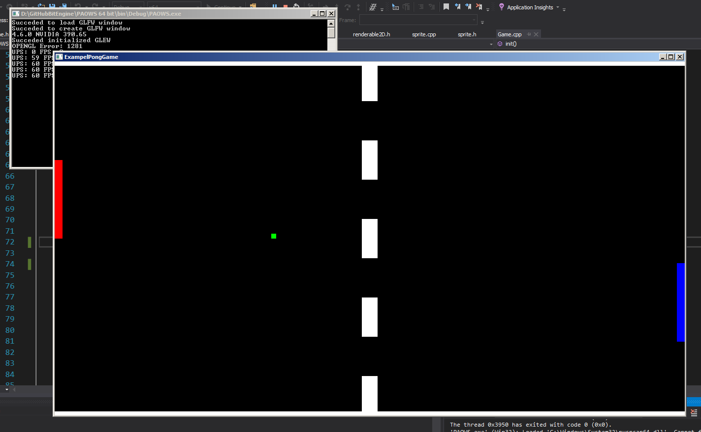

# PongGame



If at any part of this tutorial you get confused just go to the bottom and correct youreslf and send a message to me and let me come up with a solution to make the tutorial better.

You are probebly comming from [GettingStarted](GettingStarted.md) and you are probebly ready to continue and start to make a game.

This Tutorial is goping to teach you on how to add sprites, collision detection, assigning texture to sprites and layers

Now that that is out of the way lets get started

If you are not comming from [GettingStarted](GettingStarted.md) i advise you to go there and follow the steps there before you start with this one. We are going to use everything from there to begin this tutorial 
so that i dont have to go thrue all the getting started things again

Before everything we need to create a layer to add the all the sprites to and we can do it like this

Under the Window* window varibal we can create a layer varibal like this

```
Window* window;

Layer* layer;
```

Now that we have a varibal for the layer we need to initialise it so inside lets moveon to the init function and under the code that creates the window we can initialise the layer

```
void init() override 
{
	window = createWindow("ExampelPongGame", 1280, 720);

	layer = new Layer(new BatchRenderer2D(), new Shader(), maths::mat4::orthographic(-16,16, -9,9, -1,1));
}
```

Okay lets explain everything that is going here

* ```new BatchRenderer2D()``` this is the renderer we are going to use this is currently the only renderer in bitengine
* ```new Shader()``` this creates a new shader and this constructor adds the standrad shader you can creat your own shader and add that to the shader like so ```new Shader(VERTEXSHADERPATH, FREGMENTSHADERPATH)``` 
and then replase VERTEXSHADERPATH and FREGMENTSHADERPATH with the path to the shader but we whont go over this in this tutorial
* ```maths::vec4::orthographic(-16,16, -9,9, -1,1)``` we create a orthographic view, if you whant more information on this function and what the number do got to [Functions](Functions.md)

Now we need to go down to the render function and start to render all the sprites the layer has in it so render sould look like this

```
void render() override 
{
	layer->render();
}
```

Last but not least we need to remove layer when the aplication exits and we can do that in the destructor for the game class like so

```
~Game() 
{
	delete layer;
}
```

Okay yay we have created a layer but we havent populated it with anything so our next move sould be to create som sprite to add to the layer

Okay we can start by creat the playing field and to narrow that down even more lets start by creating the top and bottom sprites

To create the top and bottom we need to create 2 sprites, so to do that we first need to creat 2 varibals for them so under the window and layer varibals we can do this

```
Window* window;

Layer* layer;

Sprite* top;
Sprite* bottom;
```

okay lets put something in those varibals we can populate the like so

```
top = new Sprite(-16, 8.8, 32, 0.2, maths::vec4(1, 1, 1, 1));

bottom = new Sprite(-16, -9, 32, 0.2, maths::vec4(1, 1, 1, 1));
```

To explaing these functions in short
1. top
* Argument1 (-16) = the x position of the sprite
* Argument2 (8.8) = the y position of the sprite
* Argument3 (32) = the width of the sprite
* Argument4 (0.2) = the height of the sprite
* Argument5 (maths::vec4(1,1,1,1)) = the color of the sprite in RGBA format

2. bottom
* Argument1 (-16) = the x position of the sprite
* Argument2 (-9) = the y position of the sprite
* Argument3 (32) = the width of the sprite
* Argument4 (0.2) = the height of the sprite
* Argument5 (maths::vec4(1,1,1,1)) = the color of the sprite in RGBA format

okay after this if you start the game you will not se anything. That is because you havent added the sprites to the layer and you can do that like so

```
layer->add(top);
layer->add(bottom);
```

okay now if you run your code you should se the top and the bottom at the correct places

Next on the list for the play field is the middle stripes we can add the pritty siply whit just to add them direclt to the layer and we can do that just becaus we are not goping to use anything from the 
middle part we are just going top display it. And just to make it simple for us so that we dose not have to type ```layer->add(new sprite())``` 5 time we can use a for loop like so

```
for (int y = -9; y < 8.8; y += 4) 
{
	layer->add(new Sprite(-0.4, y, 0.8, 2, maths::vec4(1,1,1,1)));
}
```

And to make the long story short we calculate the y value with the for loop and for every y valu add a sprite to the layer with the size of widht: 0.8 and height of 2 and we ass alitle of x offset to make it more centerd

Now if you run your code you should have a nice looking play felid

After this we can create the ball and some game loop stuff for the ball

and the first thing we need to do for the ball is to create a sprite varibal for the ball and we can do it like we did for the top and the bottom so under the top and bottom varibals add a varibal like so

```
Sprite* top;
Sprite* bottom;

Sprite* ball;
```

Now that we have created the varibal as before we need to populate it and add it to layer like so

```
top = new Sprite(-16, 8.8, 32, 0.2, maths::vec4(1, 1, 1, 1));
bottom = new Sprite(-16, -9, 32, 0.2, maths::vec4(1, 1, 1, 1));

ball = new Sprite(-0.125, 0, 0.25, 0.25, maths::vec4(0, 1, 0, 1));


layer->add(top);
layer->add(bottom);

layer->add(ball);
```

and as before

* Argument1 (-0.125) = the x position of the sprite
* Argument2 (0) = the y position of the sprite
* Argument3 (0.25) = the width of the sprite
* Argument4 (0.25) = the height of the sprite
* Argument5 (maths::vec4(0,1,0,1)) = the color of the sprite in RGBA format

And now if you run your code you can se a green dot in the middle of the screen. Now we need to make some game stuff for the ball like move it.

For the movment of the ball we will have a Vector2 varibal for the x and y direction for the movment. So under all the sprite varibals we will create that varibal

```
Sprite* top;
Sprite* bottom;

Sprite* ball;

vec2* ballDirection;
``` 

now that we have a varibal lets give it some values in the init function under all the other code like so

```
layer->add(top);
layer->add(bottom);

layer->add(ball);

ballDirection = new vec2(0.4, 0.38f);
```

Okay now we have added some values for the directions but when we run the code nothing happens why is that. the solution is yuo just created the varibal and added some values but you are not using it. 
So now we need to use it so lets jump over to the update function andd add a line of code there. (If you cant finde the update function you might not have created it so just make a update function under the init function)

```
void update() override 
{
	ball->position += *ballDirection;
}
```

Okay now the ball moves around but when it hits the screen border it just disapears and it dose not interact with the top or bottom so lets add that and se if we can get the ball to bounse on the top and bottom of the screen

```
void update() override 
{
	if (ball->position.y >= 9-ball->GetSize().y) {
		ballDirection->y *= -1;
	}

	if (ball->position.y <= -9) {
		ballDirection->y *= -1;
	}

	ball->position += *ballDirection;
}
```

okay if this code is implemented over the ball movment it checks if the balls y position is over or under the orthographic height with an exeption tor y is over the it checks if ball y position is 
over orthographic height - ball size height

if any of thease contisions are met the balls y direction is reversed

now we need to check if the balls x value is over or under a sertant value and set a winner because the ball has entered a playes goal we can do that like so

```
void update() override 
{
	if (ball->position.y >= 9-ball->GetSize().y) {
		ballDirection->y *= -1;
	}

	if (ball->position.y <= -9) {
		ballDirection->y *= -1;
	}
	
	if (ball->position.x >= 16) {
		
	}

	if (ball->position.x <= -16 - ball->GetSize().x) {
		
	}

	ball->position += *ballDirection;
}
```

now it checks if the ball is in a players goal but we have no way of chekicg if someone has won som lets change that

we can start by just making a varibal that saves who is the winner like so

```
Sprite* top;
Sprite* bottom;

Sprite* ball;

vec2* ballDirection;

int winner;
```

now this is the only varibal we need for the win conditions and the game contidion

int teh init function we need to set a value to the winner int before the gameloop begins like so

```
layer->add(bottom);

layer->add(ball);

ballDirection = new vec2(0.4, 0.38f);

winner = 0;
```

okay good now why did we set it to 0 why not 1 or 2. if we sets it to 0 we can use that walut for the game loop if winner is 0 there is no winner and the game should continue and if winner is 1 or 2 there is a winner 
and we know who won

now we need to update the if statments like so

```
if (ball->position.x >= 16) {
	winner = 1;
}

if (ball->position.x <= -16 - ball->GetSize().x) {
	winner = 2;
}
```

Okay now we know who won but nothing happens when some won lets fix that but we need make some if statments in the update function and move some code but in the end it should look like this

```
void update() override {
		
	if (winner == 0) 
	{
		if (ball->position.y >= 9-ball->GetSize().y) {
			ballDirection->y *= -1;
		}

		if (ball->position.y <= -9) {
			ballDirection->y *= -1;
		}
		
		if (ball->position.x >= 16) {
			winner = 1;
		}

		if (ball->position.x <= -16 - ball->GetSize().x) {
			winner = 2;
		}

		ball->position += *ballDirection;
	}
	else if (winner == 1)
	{
	
	}
	else if (winner == 2)
	{
		
	}
}
```

As you can se if winner is 0 the game continuse and moves the ball and do the things it needs to do and if the winner is 1 or 2 it is going to do other stuff that we need to implement lets do that now

So int the other we need to do something and first we can do is to get back to play mode so we can play again. So in the if statments for winner 1 and 2 we need to add a input that checks if the player is 
pressing space then reset the winner varibal and resets the ball to the center and we can do it like so

```
else if (winner == 1)
{
	if (window->isKeyPressed(GLFW_KEY_SPACE)) 
	{
		winner = 0;
		
		ball->position.x = 0 - ball->GetSize().x / 2;
	}
}
else if (winner == 2)
{
	if (window->isKeyPressed(GLFW_KEY_SPACE)) 
	{
		winner = 0;
		
		ball->position.x = 0 - ball->GetSize().x / 2;
	}
}
```

We are just reseting the x value for the ball position and that is just to spice up the game just to make it so that the games dose not follow a pattern that you can learn

Now we need to give some feed back to the players to say hay a player has won pleas press space to start a new game. And to make this feed back we need to add a sprite with a texture on it so lets do that
lets start with just making the varibals

```
Sprite* top;
Sprite* bottom;

Sprite* Player1win;
Sprite* Player2win;

Sprite* ball;
```

Now that the varibals are created we can add them to the layer and add information to the varibals like so 

```
top = new Sprite(-16, 8.8, 32, 0.2, maths::vec4(1, 1, 1, 1));

bottom = new Sprite(-16, -9, 32, 0.2, maths::vec4(1, 1, 1, 1));

Player1win = new Sprite(-1000, -1000, 9, 3, new Texture("Example/Res/Player1.png"));
Player2win = new Sprite(-1000, -1000, 9, 3, new Texture("Example/Res/Player2.png"));

....

layer->add(top);
layer->add(bottom);

layer->add(Player1win);
layer->add(Player2win);

layer->add(ball);
```

Now you can se some difrenses btween the sprite creating code we are now adding a texture and we arte using these sprites [Player1win](Tutorial Assets/PongGameAssets/Player1.png) [Player2win](Tutorial Assets/PongGameAssets/Player2.png)
You will need to make a new foler inside the Example folder that is caller Res this is going to be used for all the resourses for youre game

The texture thing only takes a const char* with the location for the image you want to use

After this we need to add some stuff to the winner 1 and 2 if statments to make it so that the winner spries is showing up when someone wins and we can do it like so

```
else if (winner == 1) {
	Player1win->position = vec2(-4.5, -2);

	if (window->isKeyPressed(GLFW_KEY_SPACE)) {
		winner = 0;
		
		ball->position.x = 0 - ball->GetSize().x/2;

		Player1win->position = vec2(-1000, -1000);
		Player2win->position = vec2(-1000, -1000);
	}
}
else if (winner == 2) {
	Player2win->position = vec2(-4.5, -2);

	if (window->isKeyPressed(GLFW_KEY_SPACE)) {
		winner = 0;

		ball->position.x = 0 - ball->GetSize().x / 2;

		Player1win->position = vec2(-1000, -1000);
		Player2win->position = vec2(-1000, -1000);
	}
}
```

As you can se we are just moving the sprites in and out of the game view and you can also se that i am moving both winning sprite back to -1000, -1000 we do that becaus we are paranoid and whant to be 
sure that both of the winning sprites are out of view

okay yay now a player can win but we sill dose not have any player paddels for the players to control so lets change that.

first as usual lets make some varibals for the player and we will be neding 3 of them 2 sprite varibals and one float for the speel of the players we can do it like so

```
Sprite* bottom;

Sprite* player1;
Sprite* player2;

Sprite* Player1win;

....

int winner;

float speed = 0.25f;
```

We set a speed right there for conveians saker now we move on to adding it to layer and adding some content to the varibals

```
player1 = new Sprite(-16, -2, 0.4, 4, maths::vec4(1,0,0,1));
player2 = new Sprite(15.6, -2, 0.4, 4, maths::vec4(0, 0, 1, 1));

ball = new Sprite(-0.125, 0, 0.25, 0.25, maths::vec4(0, 1, 0, 1));

layer->add(top);
layer->add(bottom);

layer->add(player1);
layer->add(player2);
```

Now ass before we add some sprites with some colors and then add them to the layer

okay now comes the har part making the players move and adding some collision for the player and the ball
We will be starting with the moving of the player and we can do it with getting some input and moving the player with the speed float we made before

```
if (winner == 0) {
	if (window->isKeyPressed(GLFW_KEY_W)) {
		player1->position.y += speed;
	}
	else if (window->isKeyPressed(GLFW_KEY_S)) {
		player1->position.y -= speed;
	}

	if (window->isKeyPressed(GLFW_KEY_UP)) {
		player2->position.y += speed;
	}
	else if (window->isKeyPressed(GLFW_KEY_DOWN)) {
		player2->position.y -= speed;
	}
	
	....
}
```

As you can se we move the player depending on witch button you press and we do it for both of the player nothing difficoult

Next on check if the player is to high up or to low down we can check that with the players y value like so

```
if (winner == 0)
	
	....

	if (window->isKeyPressed(GLFW_KEY_UP)) {
		player2->position.y += speed;
	}
	else if (window->isKeyPressed(GLFW_KEY_DOWN)) {
		player2->position.y -= speed;
	}

	if (player1->position.y >= 9 - player1->GetSize().y - top->GetSize().y) {
		player1->position.y = 9 - player1->GetSize().y - top->GetSize().y;
	}

	if (player1->position.y <= -9 + bottom->GetSize().y) {
		player1->position.y = -9 + bottom->GetSize().y;
	}

	if (player2->position.y >= 9 - player2->GetSize().y - top->GetSize().y) {
		player2->position.y = 9 - player2->GetSize().y - top->GetSize().y;
	}

	if (player2->position.y <= -9 + bottom->GetSize().y) {
		player2->position.y = -9 + bottom->GetSize().y;
	}
	
	....
}
```

Now before we start to tackel the collision for the ball and players wee need to fix a thing for them we need to update the Bounds for both the players and the ball because when it moves the bounds dose not update 
with it we need to to it sepretly, ew can do it like so

```
if (winner == 0)
	
	....

	if (window->isKeyPressed(GLFW_KEY_UP)) {
		player2->position.y += speed;
	}
	else if (window->isKeyPressed(GLFW_KEY_DOWN)) {
		player2->position.y -= speed;
	}

	ball->UpdateBoundsPosition();
	player1->UpdateBoundsPosition();
	player2->UpdateBoundsPosition();

	if (player1->position.y >= 9 - player1->GetSize().y - top->GetSize().y) {
		player1->position.y = 9 - player1->GetSize().y - top->GetSize().y;
	}
	
	....
	
}
```

Okay now we can go ahead an takel the collision stuff BitEngine has a really easy thing for collision and we can just use it like so

```
if (winner == 0) 
{
	if (ball->position.y <= -9) {
		ballDirection->y *= -1;
	}

	if (ball->GetBounds().Intersects(player1->GetBounds())) {
		ballDirection->x *= -1;
	}

	if (ball->GetBounds().Intersects(player2->GetBounds())) {
		ballDirection->x *= -1;
	}

	if (ball->position.x >= 16) {
		winner = 1;
	}
}
```

You get the bounds of the ball and checks if it intersects with any of the players and if thay do just change the direction in the x value

YAY you are now done and can play the pong game you have done congratulations go nad have fun try to do some powerups for the ball to pickup or just play around and try to make a fun pong game from this base code

## SourceCode
```
#include <BitEngine.h>

using namespace BitEngine;
using namespace graphics;
using namespace maths;

class Game : public BitEngine {
private:
	//the window and the layer varibals
	Window* window;
	Layer* layer;

	//referense for all the sprites
	Sprite* top;
	Sprite* bottom;

	Sprite* player1;
	Sprite* player2;

	Sprite* Player1win;
	Sprite* Player2win;

	Sprite* ball;

	//the direction the ball is moving in;
	vec2* ballDirection;

	//a varibal to check if a player has won and with player won
	int winner;

	//the speed for the players
	float speed = 0.25f;
public:
	Game() {

	}

	~Game() {
		//deletes tha layer vaibal when the game exits to clean up memory
		delete layer;
	}

	void init() override {
		//initializes the whe window
		window = createWindow("ExampelPongGame", 1280, 720);

		//initialises the layer with a BatchRenderer and a standard shader and a orthographic view
		layer = new Layer(new BatchRenderer2D(), new Shader(), maths::mat4::orthographic(-16,16, -9,9, -1,1));

		//top
		top = new Sprite(-16, 8.8, 32, 0.2, maths::vec4(1, 1, 1, 1));

		//bottom
		bottom = new Sprite(-16, -9, 32, 0.2, maths::vec4(1, 1, 1, 1));
		
		//WinScreens
		Player1win = new Sprite(-1000, -1000, 9, 3, new Texture("Example/Res/Player1.png"));
		Player2win = new Sprite(-1000, -1000, 9, 3, new Texture("Example/Res/Player2.png"));

		//middle
		for (int y = -9; y < 8.8; y += 4) {
			layer->add(new Sprite(-0.4, y, 0.8, 2, maths::vec4(1,1,1,1)));
		}

		//player1
		player1 = new Sprite(-16, -2, 0.4, 4, maths::vec4(1,0,0,1));

		//player2
		player2 = new Sprite(15.6, -2, 0.4, 4, maths::vec4(0, 0, 1, 1));

		//ball
		ball = new Sprite(-0.125, 0, 0.25, 0.25, maths::vec4(0, 1, 0, 1));

		//adds all the sprites to my layer
		layer->add(top);
		layer->add(bottom);

		layer->add(player1);
		layer->add(player2);

		layer->add(Player1win);
		layer->add(Player2win);

		layer->add(ball);
		
		ballDirection = new vec2(0.4, 0.38f);

		winner = 0;
	}

	void tick() override {
		//spits out the UPS(updated per second) and FPS (frames per second) in the game console
		std::cout << "UPS: " << getUPS() << " FPS: " << getFPS() << std::endl;
	}

	void update() override {
		
		//checks if no player has won then do game logic
		if (winner == 0) {

			//all the player inputs
			if (window->isKeyPressed(GLFW_KEY_W)) {
				player1->position.y += speed;
			}
			else if (window->isKeyPressed(GLFW_KEY_S)) {
				player1->position.y -= speed;
			}

			if (window->isKeyPressed(GLFW_KEY_UP)) {
				player2->position.y += speed;
			}
			else if (window->isKeyPressed(GLFW_KEY_DOWN)) {
				player2->position.y -= speed;
			}

			//updates the collision bounds for all the moving sprites
			ball->UpdateBoundsPosition();
			player1->UpdateBoundsPosition();
			player2->UpdateBoundsPosition();

			//checks if player is over or under the maximum y value it can be and corrects its y value
			if (player1->position.y >= 9 - player1->GetSize().y - top->GetSize().y) {
				player1->position.y = 9 - player1->GetSize().y - top->GetSize().y;
			}

			if (player1->position.y <= -9 + bottom->GetSize().y) {
				player1->position.y = -9 + bottom->GetSize().y;
			}

			if (player2->position.y >= 9 - player2->GetSize().y - top->GetSize().y) {
				player2->position.y = 9 - player2->GetSize().y - top->GetSize().y;
			}

			if (player2->position.y <= -9 + bottom->GetSize().y) {
				player2->position.y = -9 + bottom->GetSize().y;
			}

			//if ball hits top or bottom then change direction on the y value
			if (ball->position.y >= 9-ball->GetSize().y) {
				ballDirection->y *= -1;
			}

			if (ball->position.y <= -9) {
				ballDirection->y *= -1;
			}

			//checks if ball hits the players padels then change x direction value
			if (ball->GetBounds().Intersects(player1->GetBounds())) {
				ballDirection->x *= -1;
			}

			if (ball->GetBounds().Intersects(player2->GetBounds())) {
				ballDirection->x *= -1;
			}

			//if ball is to far away on the x value set a player as winner
			if (ball->position.x >= 16) {
				winner = 1;
			}

			if (ball->position.x <= -16 - ball->GetSize().x) {
				winner = 2;
			}

			//update the ball position
			ball->position += *ballDirection;
		}
		else if (winner == 1) {
			//displays player one is winner
			Player1win->position = vec2(-4.5, -2);

			//checks if space is pressed
			if (window->isKeyPressed(GLFW_KEY_SPACE)) {
				// set is so that no one is winner :,(
				winner = 0;
				
				// replases the ball in the center
				ball->position.x = 0 - ball->GetSize().x/2;

				//removes the "player 1 won" sign
				Player1win->position = vec2(-1000, -1000);
				//to be on the safe side removes the "player 2 won sign also"
				Player2win->position = vec2(-1000, -1000);
			}
		}
		else if (winner == 2) {
			//displays player tow is winner
			Player2win->position = vec2(-4.5, -2);

			//checks if space is pressed
			if (window->isKeyPressed(GLFW_KEY_SPACE)) {
				// set is so that no one is winner :,(
				winner = 0;

				// replases the ball in the center
				ball->position.x = 0 - ball->GetSize().x / 2;

				//to be on the safe side removes the "player 1 won sign also"
				Player1win->position = vec2(-1000, -1000);
				//removes the "player 2 won" sign
				Player2win->position = vec2(-1000, -1000);
			}
		}
	}

	void render() override {
		//renders all the layers
		layer->render();
	}
};

//the main function cpp need to start a program
int main() {

	//the game class from above
	Game game;
	//starts the game
	game.start();

	//when everything is done return 0 :)
	return 0;
}
```
